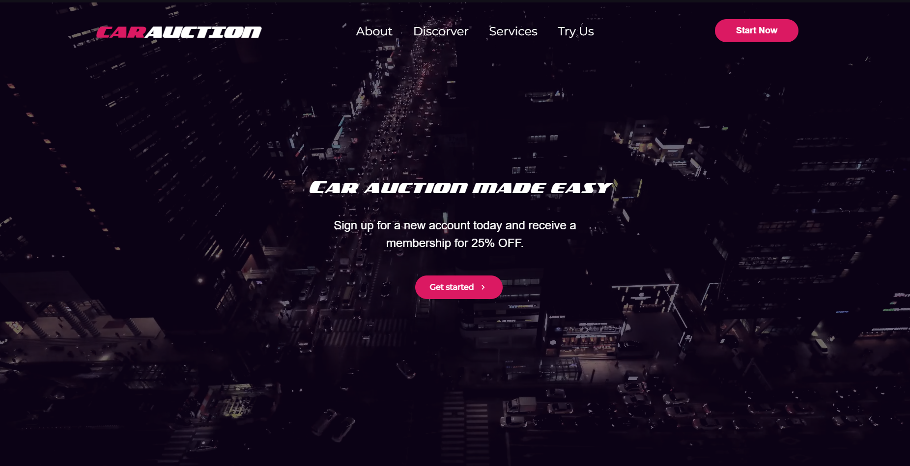
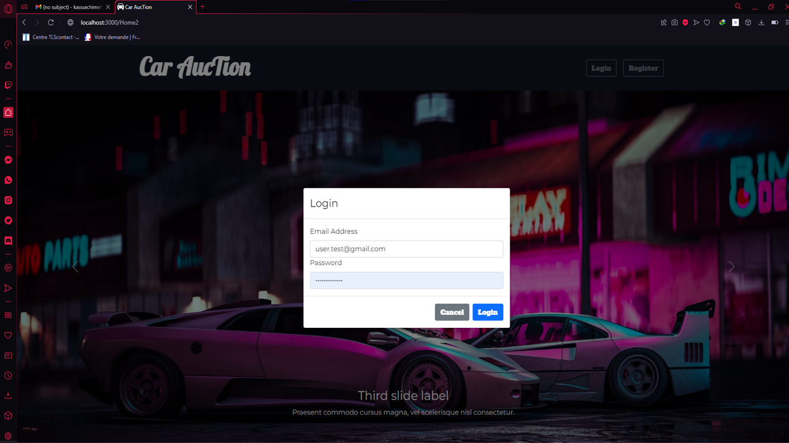

<div id="top"></div>
<!-- PROJECT LOGO -->
<br />
<div align="center">

  

  <h3 align="center">Car-Auction</h3>

  <p align="center">
    Car Auction Made Easy
    <br />
    <a href="https://github.com/Mehdi-RB26/React-Js"><strong>Explore the docs »</strong></a>
    <br />
    <br />
    <a href="https://carauction69.netlify.app">View Demo</a>
  </p>
</div>


<!-- TABLE OF CONTENTS -->
<details>
  <summary>Table of Contents</summary>
  <ol>
    <li>
      <a href="#about-the-project">About The Project</a>
      <ul>
        <li><a href="#built-with">Built With</a></li>
      </ul>
    </li>
    <li>
      <a href="#getting-started">Getting Started</a>
      <ul>
        <li><a href="#prerequisites">Prerequisites</a></li>
        <li><a href="#installation">Installation</a></li>
      </ul>
    </li>
    <li><a href="#roadmap">Roadmap</a></li>
    <li><a href="#license">License</a></li>
    <li><a href="#contact">Contact</a></li>
  </ol>
</details>


<!-- ABOUT THE PROJECT -->
## About The Project
<br>

<br>
We have vehicles for every budget and need – from family mini-vans, to sports cars, The selection varies from week to week, but there are always good, clean, used cars at excellent prices. Capital Auto Auction sells vehicles that are auctioned off by our professional independent auctioneers. The bargains are outrageous!!!
<p align="right">(<a href="#top">back to top</a>)</p>


### Built With

This section should list any major frameworks/libraries used to bootstrap your project. Leave any add-ons/plugins for the acknowledgements section. Here are a few examples.


* [React.js](https://reactjs.org/)
* [UseState](https://reactjs.org/docs/hooks-reference.html#usestate)
* [UseEffect](https://reactjs.org/docs/hooks-reference.html#useeffect)
* [UseContext](https://reactjs.org/docs/hooks-reference.html#usecontext)
* [UseRef](https://reactjs.org/docs/hooks-reference.html#useref)
* [UseFirestore](https://firebase.google.com/products/firestore?gclid=CjwKCAiA55mPBhBOEiwANmzoQq35Ste1jnK9RNdYhgzA7GNPxfcaY2yzt4gf9oA3E293WrX_1WHuEhoC5yIQAvD_BwE&gclsrc=aw.ds)
* [UseStorage](https://www.npmjs.com/package/react-use-storage)
* [Bootstrap](https://getbootstrap.com)
* [JQuery](https://jquery.com)


<p align="right">(<a href="#top">back to top</a>)</p>


<!-- GETTING STARTED -->
## Getting Started

### Installation

_Below is an example of how you can instruct your audience on installing and setting up your app. This template doesn't rely on any external dependencies or services._


1. Clone the repo
   ```sh
   git clone https://github.com/your_username_/Project-Name.git
   ```
2. Install NPM packages
   ```sh
   npm install
   ```
2. Run Project
   ```sh
   npm start
   ```

### Bidding section

After clicking on the green button (Start now !) on the top right corner in the landing page ! The bidding page will automatically appear


Like bidding website you must create an account and login to start your day :




You will notice that a new button appears in the bidding section so you can add your car if you want to get rid of it of course :D


And finally you can see your own cars and also other cars if you want to get a new ride ;)


<p align="right">(<a href="#top">back to top</a>)</p>


<!-- ROADMAP -->
## Roadmap

- [x] Add Live Chat
- [x] Add Role Managment

<p align="right">(<a href="#top">back to top</a>)</p>

<!-- LICENSE -->
## License

Distributed under the ISI License.

<p align="right">(<a href="#top">back to top</a>)</p>


<!-- CONTACT -->
## Contact

Kaouachi El Mehdi - kaouachimehdi2@gmail.com
<br>
Machmachi Mohamed - machmachimohamed1998@gmail.com
<br>
Project Link: https://github.com/Mehdi-RB26/React-Js

<p align="right">(<a href="#top">back to top</a>)</p>


<!-- MARKDOWN LINKS & IMAGES -->
<!-- https://www.markdownguide.org/basic-syntax/#reference-style-links -->
[contributors-shield]: https://img.shields.io/github/contributors/othneildrew/Best-README-Template.svg?style=for-the-badge
[contributors-url]: https://github.com/othneildrew/Best-README-Template/graphs/contributors
[forks-shield]: https://img.shields.io/github/forks/othneildrew/Best-README-Template.svg?style=for-the-badge
[forks-url]: https://github.com/othneildrew/Best-README-Template/network/members
[stars-shield]: https://img.shields.io/github/stars/othneildrew/Best-README-Template.svg?style=for-the-badge
[stars-url]: https://github.com/othneildrew/Best-README-Template/stargazers
[issues-shield]: https://img.shields.io/github/issues/othneildrew/Best-README-Template.svg?style=for-the-badge
[issues-url]: https://github.com/othneildrew/Best-README-Template/issues
[license-shield]: https://img.shields.io/github/license/othneildrew/Best-README-Template.svg?style=for-the-badge
[license-url]: https://github.com/othneildrew/Best-README-Template/blob/master/LICENSE.txt
[linkedin-shield]: https://img.shields.io/badge/-LinkedIn-black.svg?style=for-the-badge&logo=linkedin&colorB=555
[linkedin-url]: https://linkedin.com/in/othneildrew
[product-screenshot]: images/screenshot.png
